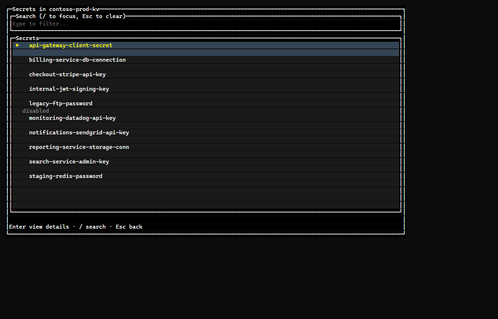
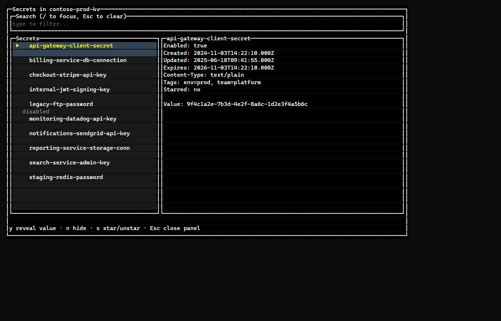

# kv-secrets-tui

A read-only terminal UI for browsing and searching Azure Key Vault secrets
across vaults. Built with [OpenTUI](https://github.com/anomalyco/opentui) and
[Bun](https://bun.sh). A TypeScript sibling to a similar .NET/Spectre.Console
app, same feature set, no company-specific settings.

This tool **only reads**. It never creates, updates, or deletes a secret --
`SecretService` only ever calls `listPropertiesOfSecrets`,
`listPropertiesOfSecretVersions`, and `getSecret`.

## Screenshots

Rendered from mock data, not a real vault.

| Secret list | Details (hidden) | Details (revealed) |
|---|---|---|
|  |  |  |

## Prerequisites

- **[Bun](https://bun.sh) >= 1.3.0** -- OpenTUI's native Zig core requires
  Bun (the alternative, very-new Node + `--experimental-ffi` path is
  unverified here). Install with:
  ```
  # macOS/Linux
  curl -fsSL https://bun.sh/install | bash
  # Windows (PowerShell)
  irm bun.sh/install.ps1 | iex
  ```
- Signed in to Azure CLI: `az login`
- Your account needs, per vault:
  - `Key Vault Secrets User` (or equivalent RBAC read role) to list/read secrets
  - `Reader` at the subscription level, to auto-discover vaults via ARM

## Install

```
bun install
```

## Run

No settings file. By default you don't need to know or paste a subscription
ID at all: on startup the app looks up every subscription your signed-in
identity (`az login`) can access, auto-picks it if there's only one, or asks
you to choose from a numbered list if there's more than one.

```
bun run start
```

Optionally add explicit vault names (guarantees they show up even without
subscription-level Reader access):

```
bun run start --vault my-vault-name
```

- `--vault <name>` -- repeatable, or set `KEYVAULT_NAMES` as a
  comma-separated list.
- `--subscription <id>` -- or set `AZURE_SUBSCRIPTION_ID` -- skips the
  subscription lookup/prompt entirely if you'd rather pass it directly
  (handy for scripting).
- `--vault <name>` -- repeatable, guarantees a vault shows up even without
  subscription-level Reader access. Or set `KEYVAULT_NAMES` as a
  comma-separated list.

Vaults found either way are merged, deduped, and sorted in the vault picker.

## Using it

- Pick a vault from the top-level menu, or **⭐ Starred secrets** to jump to
  your shortlist.
- The secret list loads lazily and scrolls continuously -- more secrets are
  fetched from Key Vault in the background as you scroll near the bottom, so
  it stays a step ahead of you instead of pausing to load a "page".

| Key | Action |
|---|---|
| `↑` / `↓` | Move selection (built into the list) |
| `Enter` | Open a secret's details panel |
| `/` | Focus the search box (first press loads every secret's name once, then filters live as you type) |
| `y` / `n` | In the details panel: reveal / don't reveal the value |
| `s` | In the details panel: star / unstar the secret |
| `Esc` | Close the details panel, then the search box, then back out |
| `Ctrl+C` | Quit |

### Starred secrets

Press `s` on any secret's details panel to add it to your personal shortlist
of commonly-checked secrets. Since the same secret name can exist in more
than one vault, the **⭐ Starred secrets** view always labels each entry with
its vault, e.g. `[my-vault] my-secret`.

Starred secrets are stored locally in a SQLite database (via Bun's built-in
`bun:sqlite`) at:

```
~/.kv-secrets-tui/starred.db
```

It only records which (vault, secret name) pairs you starred and when --
never a secret's value.

## Project layout

```
src/
  index.ts                    -- entry point: CLI args/env, auth, top-level loop
  services/
    auth.ts                    -- DefaultAzureCredential
    vaultDiscovery.ts           -- ARM vault listing + pure merge/dedupe logic
    secretService.ts             -- read-only SecretClient wrapper
    pagedSecretBrowser.ts         -- lazy buffering + background prefetch
    starredSecretsService.ts      -- bun:sqlite starred store
  ui/
    spinner.ts                    -- hand-built status/spinner line (OpenTUI has no built-in one)
    vaultPicker.ts                  -- top-level vault list + starred entry + exit
    secretListScreen.ts              -- search box + secret list + details panel
    starredView.ts                    -- cross-vault starred list
```

## Type-check

```
bun run typecheck
```
